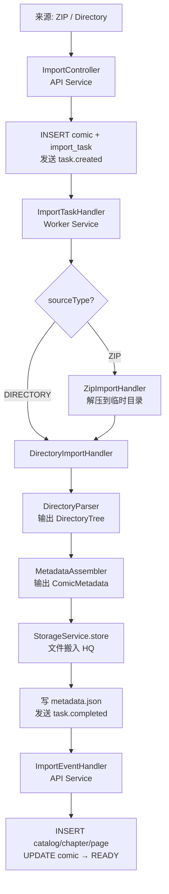

# ComicAtlas 系统全景

本文档是 ComicAtlas 项目的架构入口。目标：让新维护者在 5 分钟内理解系统由哪些模块组成、各自职责边界在哪里、数据如何流转。

---

## 系统分层

ComicAtlas 由四个运行时模块和一组基础设施组成。

```
+-----------------------------------------------------------+
|                      Frontend (Vue3)                       |
|   列表 / 详情 / 阅读器 / 导入管理 / 仪表盘 / 标签管理       |
+----------------------------+------------------------------+
                             |
                             | HTTP (REST)
                             v
+-----------------------------------------------------------+
|                   Gateway (Spring Cloud Gateway)           |
|              路由转发 + Nacos 服务发现                       |
+--------+----------------------------+---------------------+
         |                            |
         v                            v
+------------------+        +---------------------+
|   API Service    |  MQ    |   Worker Service    |
|  (Spring Boot 3) |<------>|  (Spring Boot 3)    |
|                  |        |                     |
| - HTTP API       |        | - 文件解析           |
| - MQ 消费(结果)   |        | - 文件搬运/存储       |
| - 数据库写入      |        | - MQ 消费(任务)       |
+--------+---------+        +----------+----------+
         |                            |
         v                            v
+-----------------------------------------------------------+
|                    Infrastructure                          |
|  MySQL  |  Redis  |  RabbitMQ  |  Nginx (静态文件服务)      |
+-----------------------------------------------------------+
```

### 各层说明

- **Frontend**: Vue3 + Vite 单页应用。提供漫画列表、详情页（CatalogTree）、阅读器、导入管理、仪表盘等界面。通过 Gateway 访问后端 API。
- **Gateway**: Spring Cloud Gateway。负责路由转发和 Nacos 服务发现。前端所有请求经 Gateway 分发到 API Service。
- **API Service**: 核心业务服务。提供 HTTP API、消费 Worker 发回的 MQ 结果事件、写入 MySQL 数据库。不碰文件系统。
- **Worker Service**: 文件处理服务。消费 MQ 任务消息、解析来源文件、搬运图片到存储根目录、写 metadata.json。不写数据库业务表。
- **Infrastructure**: MySQL 持久化、Redis 缓存与幂等标记、RabbitMQ 异步消息、Nginx 静态文件代理（`/files/{root}/{path}` 映射到存储目录）。

---

## 模块职责表

下表列出导入链路中的关键模块及其边界。"不做什么"一栏用于明确职责隔离。

| 模块 | 所在服务 | 职责 | 不做什么 |
|------|----------|------|----------|
| `ImportController` | API | 接收导入 HTTP 请求，创建 `comic` + `import_task` 记录，发送 MQ 任务消息 | 不碰文件系统，不解析来源 |
| `ImportService` | API | 任务持久化、状态推进、MQ 消息发送 | 不解析文件，不搬运图片 |
| `ImportTaskHandler` | Worker | 消费 `import.task.queue`，按 `sourceType` 路由到具体 Handler（`ZipImportHandler` / `DirectoryImportHandler`） | 不写数据库，不解析漫画语义 |
| `ZipImportHandler` | Worker | 解压 ZIP 到临时目录，委托 `DirectoryImportHandler` 处理 | 不解析漫画语义 |
| `DirectoryImportHandler` | Worker | 调用 `DirectoryParser` 解析目录，调用 `MetadataAssembler` 组装元数据，调用 `StorageService` 搬运文件，写 metadata.json | 不写数据库业务表 |
| `DirectoryParser` | Worker | 扫描文件系统，输出纯目录树 `DirectoryTree`（无业务语义） | 不了解 Catalog / Chapter 语义 |
| `MetadataAssembler` | Worker | 将 `DirectoryTree` 转换为 `ComicMetadata`（注入 Catalog / Chapter / Page 结构） | 不碰文件系统 |
| `StorageService` (接口) | Worker | 定义文件存储抽象：`store` / `resolve` / `exists` / `delete` | 不决定业务语义 |
| `LocalStorageService` (实现) | Worker | `StorageService` 的本地文件系统实现。基于 `StorageRoot` 配置完成文件复制、路径解析、存在性检查、删除 | 不写数据库 |
| `ImportEventHandler` | API | 消费 `import.result.queue`，读取 metadata.json，INSERT catalog / chapter / page 到数据库，更新 comic 状态为 READY | 不碰文件系统 |
| `ReaderService` | API | 按 `global_order` 取 prev / next 章节，组装阅读器 DTO | 不生成图片，不管理物理文件 |
| `FileUrlResolver` | API | 将 `Page` 实体转换为 HTTP URL（`/files/{root}/{path}`） | 不管理物理文件 |

> **关于 spec 中的概念映射**：设计文档中提到的 `HandlerFactory` 概念在当前实现中由 `ImportTaskHandler` 内部的 `switch (sourceType)` 直接承担，没有独立的 Factory 类。`StorageManager` 概念对应 `StorageService` 接口及其实现 `LocalStorageService`，加上 `DirectoryImportHandler` 中协调文件搬运和 metadata.json 写入的逻辑。

---

## 数据流总图

### 导入链路（核心流程）

```
Source (ZIP / Directory)
        |
        v
ImportController (API)
  - INSERT comic (status=IMPORTING)
  - INSERT import_task (status=PENDING)
  - 发送 MQ: comic.import.task.created
        |
        v
ImportTaskHandler (Worker)  <-- 消费 import.task.queue
  - 按 sourceType 路由:
    +-- ZIP        --> ZipImportHandler (解压) --> DirectoryImportHandler
    +-- DIRECTORY  --> DirectoryImportHandler
        |
        v
DirectoryImportHandler (Worker)
  - DirectoryParser      --> DirectoryTree (纯目录树)
  - MetadataAssembler    --> ComicMetadata (业务结构)
  - StorageService.store --> 文件搬入 HQ 存储根
  - 写 metadata.json
  - 发送 MQ: comic.import.task.completed
        |
        v
ImportEventHandler (API)  <-- 消费 import.result.queue
  - 读取 metadata.json
  - INSERT catalog / chapter / page
  - UPDATE comic (status=READY)
  - UPDATE import_task (status=SUCCESS)
```

### Mermaid 流程图



### 其他数据流

| 流程 | 触发 | 路径 |
|------|------|------|
| 阅读 | 用户打开章节 | Frontend → API `ReaderService` → `FileUrlResolver` → Nginx 静态文件 |
| LQ 生成 | 用户手动触发 | API `LqController` → MQ `comic.image.lq.generate` → Worker → 生成 LQ 图片 |
| 漫画删除 | 用户删除漫画 | API → MQ `comic.delete.requested` → Worker 删除物理文件 → API 逻辑删除 DB 记录 |
| 任务状态同步 | Worker 进度变化 | Worker `TaskStatusPublisher` → MQ `comic.task.status.changed` → API `ImportEventHandler` 更新 import_task |

---

## 核心设计原则

### 1. Worker 不写数据库，API 不碰文件系统

这是系统最重要的边界。Worker 完成文件处理后，通过 MQ 事件通知 API，由 API 写入数据库。两者通过 `metadata.json` 文件传递结构化数据。

- Worker 产出：物理文件（HQ/LQ/Thumbs）+ `metadata.json`
- API 消费：读取 `metadata.json`，写入 catalog / chapter / page 表

这条边界保证了 Worker 可以独立部署、独立扩缩，不会与 API 争抢数据库连接。

### 2. 解析与语义分离

`DirectoryParser` 只负责扫描文件系统，输出纯目录树 `DirectoryTree`。它不知道什么是 Catalog、什么是 Chapter。

`MetadataAssembler` 负责将 `DirectoryTree` 转换为 `ComicMetadata`，注入业务语义（哪些目录是卷、哪些是章、页码如何编排）。

这种分离让 Parser 可以专注于文件系统的复杂性（编码、嵌套、命名规则），而 Assembler 专注于业务规则。

### 3. 存储抽象

文件存储通过 `StorageService` 接口抽象。当前实现 `LocalStorageService` 使用本地文件系统，但接口允许未来扩展到对象存储（S3/MinIO）等后端，而不影响上层调用方。

`StorageService` 的四个方法：

- `store(source, rootKey, relativePath)` — 将源文件复制到指定存储根
- `resolve(ref)` — 将 `StorageRef` 解析为物理路径
- `exists(ref)` — 检查文件是否存在
- `delete(ref)` — 删除文件

### 4. 所有导入统一 MANAGED 存储

当前阶段所有漫画统一使用 MANAGED 存储策略：文件搬入 `D:/manga/hq/{comicId}/{chapterId}/`，由 ComicAtlas 统一管理生命周期。DB 中 `page.hq_root` 存存储根 key（如 `HQ`），`page.hq_path` 存相对路径。

### 5. URL 统一由 FileUrlResolver 生成

图片 URL 不手拼。所有 `Page` 到 URL 的转换统一走 `FileUrlResolver.resolve(page)`，输出格式为 `/files/{rootKey_lc}/{relativePath}`。Nginx 负责将 `/files/` 前缀映射到实际存储目录。

### 6. 异步消息驱动

导入、LQ 生成、删除等耗时操作全部通过 RabbitMQ 异步执行。MQ 承担解耦和削峰职责。所有主队列配置死信交换机（DLX）和死信队列（DLQ），保证失败消息不丢失。

---

## 技术栈速查

| 层 | 技术 | 版本 |
|----|------|------|
| Frontend | Vue3 + Vite + Element Plus + Pinia | Vue 3.x |
| Gateway | Spring Cloud Gateway | Spring Boot 3.x |
| API Service | Spring Boot 3 + MyBatis Plus | Spring Boot 3.x |
| Worker Service | Spring Boot 3 | Spring Boot 3.x |
| 数据库 | MySQL | 8.x |
| 缓存 | Redis | 7.x |
| 消息队列 | RabbitMQ | 3.x |
| 服务发现 | Nacos | 2.x |
| 静态文件 | Nginx | 1.x |

---

## 下一步阅读

- 导入流水线详细设计：`docs/architecture/02-import-pipeline.md`
- 存储模型与策略：`docs/architecture/03-storage.md`
- 数据库表结构：`docs/database/schema.md`
- API 接口文档：`docs/api.md`
