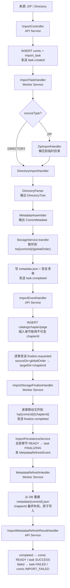

# ComicAtlas 系统全景

本文档是 ComicAtlas 项目的架构入口。目标：让新维护者在 5 分钟内理解系统由哪些模块组成、各自职责边界在哪里、数据如何流转。

---

## 系统分层

ComicAtlas 由四个运行时模块和一组基础设施组成。

```
+-----------------------------------------------------------+
|                      Frontend (Vue3)                       |
|   列表 / 详情 / 阅读器 / 导入管理 / 管理后台 / 存储管理       |
+----------------------------+------------------------------+
                             |
                             | HTTP (REST)
                             v
+-----------------------------------------------------------+
|                   Gateway (Spring Cloud Gateway)           |
|              路由转发 + Nacos 服务发现                       |
+--------+----------------------------+---------------------+
         |                            |
         v                            v
+------------------+        +---------------------+
|   API Service    |  MQ    |   Worker Service    |
|  (Spring Boot 3) |<------>|  (Spring Boot 3)    |
|                  |        |                     |
| - HTTP API       |        | - 文件解析           |
| - MQ 消费(结果)   |        | - 文件搬运/存储       |
| - 数据库写入      |        | - MQ 消费(任务)       |
+--------+---------+        +----------+----------+
         |                            |
         v                            v
+-----------------------------------------------------------+
|                    Infrastructure                          |
|  MySQL  |  Redis  |  RabbitMQ  |  Nginx (静态文件服务)      |
+-----------------------------------------------------------+
```

### 各层说明

- **Frontend**: Vue3 + Vite 单页应用。提供漫画列表、详情页（CatalogTree）、阅读器、导入管理、管理后台等界面。通过 Gateway 访问后端 API。
- **Gateway**: Spring Cloud Gateway。负责路由转发和 Nacos 服务发现。前端所有请求经 Gateway 分发到 API Service。
- **API Service**: 核心业务服务。提供 HTTP API、消费 Worker 发回的 MQ 结果事件、写入 MySQL 数据库。合并元数据刷新快照并驱动 DB 差异落库。不碰文件系统。
- **Worker Service**: 文件处理服务。消费 MQ 任务消息、解析来源文件、搬运图片到存储根目录、写 metadata.json；元数据刷新时扫描 HQ 目录生成 STAGING 快照。不写数据库业务表。
- **Infrastructure**: MySQL 持久化、Redis 缓存与幂等标记、RabbitMQ 异步消息、Nginx 静态文件代理（`/files/{root}/{path}` 映射到存储目录）。

---

## 模块职责表

下表列出导入链路中的关键模块及其边界。"不做什么"一栏用于明确职责隔离。

| 模块 | 所在服务 | 职责 | 不做什么 |
|------|----------|------|----------|
| `ImportController` | API | 接收导入 HTTP 请求，创建 `comic` + `import_task` 记录，发送 MQ 任务消息 | 不碰文件系统，不解析来源 |
| `ImportService` | API | 任务持久化、状态推进、MQ 消息发送 | 不解析文件，不搬运图片 |
| `ImportTaskHandler` | Worker | 消费 `import.task.queue`，按 `sourceType` 路由到具体 Handler（`ZipImportHandler` / `DirectoryImportHandler`） | 不写数据库，不解析漫画语义 |
| `ZipImportHandler` | Worker | 解压 ZIP 到临时目录，委托 `DirectoryImportHandler` 处理 | 不解析漫画语义 |
| `DirectoryImportHandler` | Worker | 调用 `DirectoryParser` 解析目录，调用 `MetadataAssembler` 组装元数据，调用 `StorageService` 把文件暂存到 `hq/{comicId}/{globalOrder}`（两阶段之第一阶段 staging），写 metadata.json | 不写数据库业务表，不生成 chapterId |
| `DirectoryParser` | Worker | 扫描文件系统，输出纯目录树 `DirectoryTree`（无业务语义） | 不了解 Catalog / Chapter 语义 |
| `MetadataAssembler` | Worker | 将 `DirectoryTree` 转换为 `ComicMetadata`（注入 Catalog / Chapter / Page 结构） | 不碰文件系统 |
| `StorageService` (接口) | Worker | 定义文件存储抽象：`transfer` / `resolve` / `exists` / `delete` | 不决定业务语义 |
| `TransferService` (实现) | Worker | `StorageService` 的本地文件系统实现，按 `TransferMode`（COPY/MOVE）完成文件复制/移动、路径解析、存在性检查、删除 | 不写数据库 |
| `StorageRoot` / `ApiStorageRoot` | Worker/API | 存储根解析：词法校验（normalize + startsWith）+ 真实路径 containment（toRealPath）双重防线，拒绝 `../` 穿越与经 symlink/junction/reparse point 逃出根 | 不决定业务语义 |
| `ImportEventHandler` | API | 消费 `import.result.queue`，读取 metadata.json，INSERT catalog / chapter / page 到数据库；插入章节取得不可变 `chapterId`，逐章发送最终化请求；全部章节最终化完成才进入 metadata 重建收尾 | 不碰文件系统 |
| `ImportPersistenceService` | API | 两阶段落库编排：completed 插入结构并保持 IMPORTING/PENDING，finalize completed/failed 按章节累加收尾；全部章节 READY 后 task → FINALIZING 并发 MetadataRefreshEvent 请求 DB→JSON 重建，重建成功结果事件后才 comic READY / task SUCCESS，失败可重试 | 不搬文件，不在事务内做 IO |
| `ImportStorageFinalizeHandler` | Worker | 消费最终化请求，逐章把 `hq/{comicId}/{globalOrder}` 暂存目录移动到 `hq/{comicId}/{chapterId}`，每章发布 Completed | 不写数据库业务表 |
| `MetadataRefreshHandler` | Worker | 消费 `MetadataRefreshEvent`（taskId 非空=导入收尾触发），从 DB 重建 `metadata/{comicId}.json`（hqPath 天然为 `{comicId}/{chapterId}` 最终布局），发布 ImportMetadataRefreshCompleted/Failed | 不写数据库业务表 |
| `ImportMetadataRefreshResultHandler` | API | 消费 `import.metadata.refresh.completed/failed`，inbox 幂等后委托 Service 收尾：completed → comic READY / task SUCCESS；failed → task FAILED / comic IMPORT_FAILED | 不碰文件系统 |
| `ReaderService` | API | 按 `global_order` 取 prev / next 章节，组装阅读器 DTO | 不生成图片，不管理物理文件 |
| `FileUrlResolver` | API | 将 `Page` 实体转换为 HTTP URL（`/files/{root}/{path}`） | 不管理物理文件 |

> **关于设计概念的说明**：设计文档中提到的"按来源路由"概念在当前实现中由 `ImportTaskHandler` 内部的 `switch (sourceType)` 直接承担，没有独立的路由类。"文件生命周期管理"概念对应 `StorageService` 接口及其实现 `TransferService`，加上 `DirectoryImportHandler` 中协调文件搬运和 metadata.json 写入的逻辑。

---

## 数据流总图

### 导入链路（核心流程）

```
Source (ZIP / Directory)
        |
        v
ImportController (API)
  - INSERT comic (status=IMPORTING)
  - INSERT import_task (status=PENDING)
  - 发送 MQ: comic.import.task.created
        |
        v
ImportTaskHandler (Worker)  <-- 消费 import.task.queue
  - 按 sourceType 路由:
    +-- ZIP        --> ZipImportHandler (解压) --> DirectoryImportHandler
    +-- DIRECTORY  --> DirectoryImportHandler
        |
        v
DirectoryImportHandler (Worker)   <-- 两阶段之第一阶段：staging
  - DirectoryParser      --> DirectoryTree (纯目录树)
  - MetadataAssembler    --> ComicMetadata (业务结构)
  - StorageService.transfer --> 文件暂存 HQ: hq/{comicId}/{globalOrder}（DB ID 生成前的漫画内暂存键）
  - 写 metadata.json + 恢复清单
  - 发送 MQ: comic.import.task.completed
        |
        v
ImportEventHandler (API)  <-- 消费 import.result.queue
  - 读取 metadata.json
  - INSERT catalog / chapter / page（插入章节取得不可变 chapterId，comic 保持 IMPORTING、media PENDING）
  - 逐章发送 MQ: comic.import.import.storage.finalize.requested（sourceDir=globalOrder → targetDir=chapterId）
        |
        v
ImportStorageFinalizeHandler (Worker)  <-- 消费 finalize.requested（两阶段之第二阶段：最终化）
  - 逐章把 hq/{comicId}/{globalOrder} 移动到 hq/{comicId}/{chapterId}
  - 每章发送 MQ: comic.import.import.storage.finalize.completed
        |
        v
ImportPersistenceService (API)  <-- 消费 finalize.completed
  - 逐章 media/chapter → READY；全部章节完成（pendingCount==0）
  - 发 MetadataRefreshEvent(taskId, comicId) → task → FINALIZING（comic 仍 IMPORTING）
        |
        v
MetadataRefreshHandler (Worker)  <-- 消费 comic.export.metadata.refresh.requested（taskId 非空分支）
  - 从 DB 重建 metadata/{comicId}.json（hqPath 天然为 {comicId}/{chapterId} 最终布局，原子写入）
  - 发送 MQ: comic.import.import.metadata.refresh.completed / failed
        |
        v
ImportMetadataRefreshResultHandler (API)  <-- 消费 metadata 重建结果
  - inbox 幂等：completed → comic READY / task SUCCESS
  - failed → task FAILED / comic IMPORT_FAILED（可重试，旧 JSON 完整）
```

### Mermaid 流程图


```mermaid
flowchart TD
    A[来源: ZIP / Directory] --> B[ImportController<br/>API Service]
    B --> C["INSERT comic + import_task<br/>发送 task.created"]
    C --> D[ImportTaskHandler<br/>Worker Service]
    D --> E{sourceType?}
    E -->|ZIP| F[ZipImportHandler<br/>解压到临时目录]
    E -->|DIRECTORY| G[DirectoryImportHandler]
    F --> G
    G --> H[DirectoryParser<br/>输出 DirectoryTree]
    H --> I[MetadataAssembler<br/>输出 ComicMetadata]
    I --> J["StorageService.transfer<br/>暂存到 hq/{comicId}/{globalOrder}"]
    J --> K["写 metadata.json + 恢复清单<br/>发送 task.completed"]
    K --> L[ImportEventHandler<br/>API Service]
    L --> M["INSERT catalog/chapter/page<br/>插入章节取得不可变 chapterId"]
    M --> N["逐章发送 finalize.requested<br/>sourceDir=globalOrder → targetDir=chapterId"]
    N --> O[ImportStorageFinalizeHandler<br/>Worker Service]
    O --> P["逐章移动文件到 hq/{comicId}/{chapterId}<br/>发送 finalize.completed"]
    P --> Q["ImportPersistenceService<br/>全部章节 READY → task FINALIZING<br/>发 MetadataRefreshEvent"]
    Q --> R[MetadataRefreshHandler<br/>Worker Service]
    R --> S["从 DB 重建 metadata/{comicId}.json<br/>chapterId 最终布局，原子写入"]
    S --> T[ImportMetadataRefreshResultHandler<br/>API Service]
    T --> U["completed → comic READY / task SUCCESS<br/>failed → task FAILED / comic IMPORT_FAILED"]
```

### 其他数据流

| 流程 | 触发 | 路径 |
|------|------|------|
| 阅读 | 用户打开章节 | Frontend → API `ReaderService` → `FileUrlResolver` → Nginx 静态文件 |
| LQ 生成 | 用户手动触发 | API 创建管理命令（`LQ_GENERATE`，COMIC/CHAPTER 目标）→ MQ `comic.management.command.requested` → Worker `LqCommandHandler` 生成 LQ 图片（仅 IMAGE）→ 回传 `command.completed` → API 按 targetType 校验归属（COMIC 经章节归属校验、CHAPTER 按章节校验）后更新 media |
| 视频转码 | 用户手动触发 | API 创建管理命令（`TRANSCODE`，MEDIA 目标）→ MQ `comic.management.command.requested` → Worker `TranscodeCommandHandler` 输出 `.probe.mp4` 临时文件，ffmpeg 转码 + ffprobe 验证容器/codec 后才原子发布 → 回传 `command.completed` → API 更新 media |
| HQ 删除 | 用户手动触发 | API 创建管理命令（`HQ_DELETE`）→ MQ `comic.management.command.requested` → Worker 仅删除 `media_type='IMAGE'` 的 HQ 文件（VIDEO 文件/状态/统计不触碰）→ 回传 `command.completed` → API 仅对 IMAGE 置 hq_status=DELETED |
| 漫画删除（回收） | 用户删除漫画 | API 创建管理任务（`COMIC_DELETE`）→ MQ `comic.management.command.requested` → Worker 移入 trash 卷 → API 更新生命周期为 `TRASHED`；永久删除走 `purge`（`TRASHED` + 7 天保留期 + 二次确认） |
| 任务状态同步 | Worker 进度变化 | Worker `TaskStatusPublisher` → MQ `comic.task.status.changed` → API `ImportEventHandler` 更新 import_task |

---

## 核心设计原则

### 1. Worker 不写数据库，API 不碰文件系统

这是系统最重要的边界。Worker 完成文件处理后，通过 MQ 事件通知 API，由 API 写入数据库。两者通过 `metadata.json` 文件传递结构化数据。导入采用**两阶段最终化 + 元数据重建收尾**：Worker 先以 `globalOrder` 作为 DB ID 未生成前的漫画内暂存键把文件落到 `hq/{comicId}/{globalOrder}`（staging），API 读取 `metadata.json` 写入结构并生成不可变 `chapterId`，再逐章请求 Worker 把文件移动到正式 `hq/{comicId}/{chapterId}`；全部章节 READY 后 task 进入 **FINALIZING** 中间态，API 经 `MetadataRefreshEvent(taskId, comicId)` 请求 Worker 从 DB 重建 `metadata/{comicId}.json`（chapterId 最终布局），只有重建成功结果事件返回后 API 才将 comic 置为 READY、task 置为 SUCCESS。

- Worker 产出：物理文件（暂存于 `hq/{comicId}/{globalOrder}`）+ `metadata.json` + 恢复清单
- API 消费：读取 `metadata.json`，写入 catalog / chapter / page 表，生成 `chapterId` 并驱动最终化
- Worker 再搬运：按 `chapterId` 把文件移动到 `hq/{comicId}/{chapterId}`（两阶段之第二阶段）
- canonical metadata：最终化完成后 `metadata/{comicId}.json` 由 DB 重建（不再保留 globalOrder 暂存布局），是灾难恢复与转码/刷新重建的统一产物

元数据刷新遵循同一边界：Worker 只读 DB 基线后按 `HQ/{comicId}/{chapterId}` 逐章扫描，写 STAGING 快照（SHA-256 + `databaseRevision`），API 校验后事务合并 DB（磁盘缺失行标记 `HQ MISSING`），CAS 释放 `REFRESHING → READY`，再经 Outbox 重导出 `metadata.json`（安全 DB→JSON 链）。**单一元数据刷新拓扑**：孤儿视频元数据修复管线已下线（F6-10），`COMIC/METADATA_REFRESH` 管理命令与导入收尾的 metadata 重建是仅有的两条 DB→JSON 维护链。

这条边界保证了 Worker 可以独立部署、独立扩缩，不会与 API 争抢数据库连接。

### 2. 解析与语义分离

`DirectoryParser` 只负责扫描文件系统，输出纯目录树 `DirectoryTree`。它不知道什么是 Catalog、什么是 Chapter。

`MetadataAssembler` 负责将 `DirectoryTree` 转换为 `ComicMetadata`，注入业务语义（哪些目录是卷、哪些是章、页码如何编排）。

这种分离让 Parser 可以专注于文件系统的复杂性（编码、嵌套、命名规则），而 Assembler 专注于业务规则。

### 3. 存储抽象

文件存储通过 `StorageService` 接口抽象。当前实现 `TransferService` 使用本地文件系统，但接口允许未来扩展到对象存储（S3/MinIO）等后端，而不影响上层调用方。

`StorageService` 的四个方法：

- `transfer(source, target, mode)` — 按 `TransferMode`（COPY/MOVE）将源文件复制/移动到目标 `StorageRef`
- `resolve(ref)` — 将 `StorageRef` 解析为物理路径
- `exists(ref)` — 检查文件是否存在
- `delete(ref)` — 删除文件

所有路径解析统一经 `StorageRoot`/`ApiStorageRoot.resolve()` 完成**双重防线校验**：

1. **词法校验**：`normalize()` + `startsWith` 拦截 `../` 穿越与绝对路径注入；
2. **真实路径 containment**：`toRealPath()` 比较根与目标的真实路径，拒绝经 symlink/junction/reparse point 逃出根（目标尚不存在时按最近已存在父目录校验，允许根内安全创建）。

任一防线被击穿即抛 `PathTraversalException`，且每次解析都重新执行真实路径校验，避免"校验与 IO 之间链接被替换"的 TOCTOU 窗口。

### 4. 所有导入统一 MANAGED 存储

当前阶段所有漫画统一使用 MANAGED 存储策略：文件搬入 `F:/manga/hq/{comicId}/{chapterId}/`，由 ComicAtlas 统一管理生命周期。DB 中 `page.hq_root` 存存储根 key（如 `HQ`），`page.hq_path` 存相对路径。

**路径规范**：正式文件路径统一为 `{comicId}/{chapterId}` 布局；`globalOrder` 只承担两个职责——阅读顺序（prev/next）与导入暂存键（`hq/{comicId}/{globalOrder}`，DB ID 生成前使用）。任何按 DB 路径操作（回收 manifest、转码、LQ、HQ 删除、恢复）都必须读取 `page.hq_path`/`lq_path` 真实值，禁止用 `globalOrder` 猜测目录。

### 5. URL 统一由 FileUrlResolver 生成

图片 URL 不手拼。所有 `Page` 到 URL 的转换统一走 `FileUrlResolver.resolve(page)`，输出格式为 `/files/{rootKey_lc}/{relativePath}`。Nginx 负责将 `/files/` 前缀映射到实际存储目录。

### 6. 异步消息驱动

导入、LQ 生成、删除等耗时操作全部通过 RabbitMQ 异步执行。MQ 承担解耦和削峰职责。所有主队列配置死信交换机（DLX）和死信队列（DLQ），保证失败消息不丢失。

---

## 技术栈速查

| 层 | 技术 | 版本 |
|----|------|------|
| Frontend | Vue3 + Vite + Element Plus + Pinia | Vue 3.x |
| Gateway | Spring Cloud Gateway | Spring Boot 3.x |
| API Service | Spring Boot 3 + MyBatis Plus | Spring Boot 3.x |
| Worker Service | Spring Boot 3 | Spring Boot 3.x |
| 数据库 | MySQL | 8.x |
| 缓存 | Redis | 7.x |
| 消息队列 | RabbitMQ | 3.x |
| 服务发现 | Nacos | 2.x |
| 静态文件 | Nginx | 1.x |

---

## 下一步阅读

- 导入流水线详细设计：`docs/architecture/02-import-pipeline.md`
- 存储模型与策略：`docs/architecture/03-storage.md`
- 数据库表结构：`docs/database/schema.md`
- API 接口文档：`docs/api.md`
