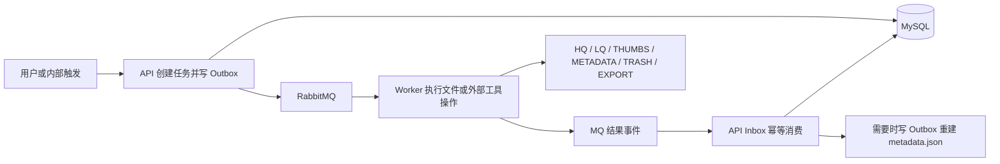

# ComicAtlas 媒体处理与生命周期能力设计

**最后更新**：2026-08-10  
**状态**：目标设计基线  
**适用范围**：导入、导出、LQ、视频转码、元数据维护、HQ 删除、回收站与数据库灾难恢复

---

## 1. 文档目的

本文统一定义 ComicAtlas 的媒体处理能力、任务边界和数据一致性规则。它描述目标架构，不代表所有能力已经完成；具体上线状态以代码、API 文档和发布说明为准。

系统遵循以下固定边界：

- API 是唯一业务 HTTP 入口，也是唯一数据库写入方。
- Worker 通过 MQ 接收任务，负责文件、压缩包和外部工具，不写业务数据库。
- 导入、导出文件使用服务器可访问的本地路径，不通过 HTTP 上传或下载文件内容。
- MySQL 是日常业务事实源；`metadata.json` 是可重建的结构化副本和灾难恢复依据。
- 跨服务操作使用 MQ；数据库状态与待发送事件使用 Outbox，结果消费使用 Inbox 和业务状态实现幂等。
- 普通维护操作只处理明确指定的 `comicId`；只有独立的数据库灾难恢复模式允许枚举存储索引。

## 2. 能力总览

| 功能 | 输入依据 | Worker 职责 | API 职责 | 是否重建 metadata |
|------|----------|-------------|----------|---------------------|
| 漫画导入 | 路径或 ZIP | 解析、分析、搬运、封面、导入快照 | 注册目录、章节和媒体，完成存储最终化 | 是 |
| 漫画集扫描 | 漫画集根路径 | 返回候选漫画及预览 | 返回扫描结果；用户确认后才创建导入任务 | 否 |
| ZIP 导出 | comicId | 完整性校验、打包、分卷 | 管理导出任务和产物清单 | ZIP 内生成快照 |
| LQ 生成 | comicId/图片项 | 调用图片优化工具生成 LQ | 更新 LQ 状态和路径 | 通常否 |
| 视频转码 | comicId/视频项 | ffmpeg 转码和 ffprobe 验证 | 更新视频字段和转码状态 | 是 |
| 媒体元数据刷新 | comicId | 精确扫描目标漫画并重新分析 | 只更新已有媒体 | 是 |
| metadata 重建 | comicId | 原子写入 JSON | 从数据库生成规范化快照 | 本身就是重建 |
| 统计重算 | comicId | 通常不参与 | SQL 聚合或缓存失效 | 否 |
| HQ 删除 | comicId/图片项 | 删除满足条件的 HQ 文件 | 更新 HQ 状态，保留 LQ 引用 | 是 |
| 移入回收站 | comicId | 按 Trash Manifest 移动文件 | 更新生命周期状态 | 否 |
| 回收站恢复 | trashTaskId | 按 Manifest 移回文件 | 恢复原数据库记录状态 | 恢复后重建 |
| 永久删除 | trashTaskId | 删除回收站文件 | 文件成功删除后删除数据库记录 | 否 |
| 数据库灾难恢复 | 管理员显式操作 | 扫描 metadata 索引并验证精确文件 | 按用户选择重建业务数据 | 恢复后重建 |

## 3. 总体任务边界



任务通用要求：

1. API 在事务内创建任务、任务项和 Outbox，不在提交后直接裸发 RabbitMQ。
2. Worker 使用 `taskId + itemId + attempt` 标识执行，结果必须携带相同身份。
3. Worker 的业务失败发布明确失败结果并 ACK；可重试基础设施错误进入既定重试和 DLQ。
4. API 使用 Inbox、任务项当前 attempt 和非终态 CAS 防止重复落库。
5. 文件产物先写临时位置，校验成功后原子发布；失败产物和外部进程必须清理。
6. 批量任务允许部分成功，但每个任务项必须有可定位的结果和错误码。

## 4. 漫画导入

### 4.1 支持的入口

- 路径导入：API 只提交服务器可访问的漫画目录路径。
- ZIP 导入：API 只提交服务器可访问的 `.zip` 路径。
- 漫画集根路径扫描：只发现候选漫画，不自动创建 `comic`、`import_task` 或导入 MQ 消息。

漫画集扫描流程：

```text
API 提交漫画集根路径
→ Worker 将根路径的直接子目录识别为候选漫画
→ Worker 递归统计每个候选内部的目录、图片和视频
→ Worker 返回候选集合、规范化预览和警告
→ API 返回扫描结果
→ 用户在前端批量选择需要导入的漫画
→ 用户确认后，API 才为选中的每本漫画创建独立导入任务
```

扫描取消、扫描失败或用户没有选择候选时，不产生导入任务。

### 4.2 导入主链

```text
路径导入 / ZIP 导入
→ API 创建 comic(IMPORTING) 和 import_task(PENDING)
→ Outbox/MQ 发送导入命令
→ Worker 解析目录树并规范化 Catalog/Chapter
→ 分析图片尺寸和视频 ffprobe 元数据
→ 按统一兼容策略标记视频
→ 生成封面
→ 媒体进入 MANAGED 暂存位置
→ 生成导入 metadata 快照
→ Worker 发布导入完成事件
→ API 批量写入 catalog/chapter/page
→ API 逐章提交存储最终化命令
→ Worker 将暂存目录最终化为 chapterId 布局
→ API 确认全部章节 READY
→ 重建规范化 metadata.json
→ comic READY、import_task SUCCESS
```

视频导入只记录状态，不自动转码：

| 分析结果 | transcodeStatus |
|----------|-----------------|
| 已符合项目播放标准 | `NOT_NEEDED` |
| 可分析但不符合标准 | `REQUIRED` |
| ffprobe 或兼容性分析失败 | 明确失败/未知状态，不得默认兼容 |

导入阶段不生成 LQ、不转码视频。媒体入库必须使用受控批次写入，禁止每页一次数据库往返。

### 4.3 存储最终化

```text
Worker 暂存：HQ/{comicId}/{globalOrder}/{fileName}
API 获得 chapterId 后提交最终化：
HQ/{comicId}/{globalOrder}
→ HQ/{comicId}/{chapterId}
```

最终数据库中的 `hqPath` 必须指向 `{comicId}/{chapterId}/{fileName}`。导入完成事件只表示解析和暂存完成；只有全部章节最终化成功后，漫画才能进入 READY。

### 4.4 封面规则

1. 优先匹配明确的封面文件名，如 `cover`、`封面`、`表紙`、`front`、`folder`。
2. 没有命名候选时使用全书第一张有效图片。
3. 全部媒体为视频时，从第一个有效视频抽帧。
4. 单个候选失败时继续尝试下一候选。
5. 全部候选失败时导入可继续，前端使用占位封面并记录警告。

## 5. ZIP 导出

```text
API 根据 comicId 创建导出任务
→ Worker 查询并收集漫画目录、章节和媒体
→ 校验所有应导出媒体存在且可读
→ 生成 ZIP 内 metadata.json
→ 流式生成单卷或分卷 ZIP
→ 校验全部产物
→ 原子发布产物集合
→ Worker 发布完成事件
→ API 保存导出任务和卷清单
```

导出规则：

- 默认必须完整导出；任一应导出媒体缺失时整个导出失败，不能静默跳过。
- 不需要记录 `sourceQuality`；本地项目只保证导出不缺失。
- 普通产物为 `漫画名.zip`。
- 大文件使用标准分卷命名：`漫画名.z01`、`漫画名.z02`、……、`漫画名.zip`。
- 分卷大小可配置，建议默认 2 GiB；同时启用 ZIP64 支持大文件和大量条目。
- ZIP64 与分卷是两个独立概念，必须分别配置和测试。
- 所有卷成功关闭并验证后，任务才能标记成功。
- 重新导入时，合法 metadata 可作为结构化导入依据；没有合法 metadata 的普通 ZIP 走目录解析。
- 分卷 ZIP 导入选择最后一卷 `.zip`，系统发现同目录的连续 `.z01`、`.z02`；缺卷、重号或不可读时直接失败。

分卷导出属于目标能力，上线前不得在用户指南中标记为已完成。

## 6. LQ 生成

```text
API 根据 comicId 查询 HQ READY 的图片
→ 创建漫画任务及逐媒体任务项
→ Worker 调用 image-optimizer
→ 生成 LQ/{comicId}/{chapterId}/{fileName}.webp
→ Worker 发布逐项结果
→ API 更新 lqRoot、lqPath 和 lqStatus
```

约束：

- 只处理 `mediaType=IMAGE`，视频不生成 LQ。
- 默认由用户手动触发，不在导入后自动执行。
- 已存在且校验有效的 LQ 可以幂等跳过。
- 单张失败不阻断其他图片，漫画任务可进入部分成功。
- Worker 不更新数据库。
- 当前 metadata 不承担 LQ 恢复时，LQ 完成后无需重建 metadata；若未来 metadata 保存 LQ 引用，再增加重建触发。

## 7. 视频转码

```text
API 根据 comicId 查询 transcodeStatus=REQUIRED 的视频
→ 创建逐视频任务项
→ Worker 调用 ffmpeg 输出临时文件
→ ffprobe 验证容器、视频编码、音频编码和时长
→ 原子替换或发布标准视频
→ Worker 发布逐项结果
→ API 更新媒体字段和转码状态
→ Outbox 触发 metadata.json 重建
```

兼容性不能只根据扩展名判断，必须统一检查容器、视频编码、音频编码、像素格式和浏览器播放能力。

只处理 `REQUIRED`；不得重复处理 `QUEUED`、`TRANSCODING` 或 `READY`。转码成功且验证通过前不得删除或覆盖原文件。取消、超时和线程中断时必须终止完整 ffmpeg 进程树并清理临时文件。

## 8. 媒体元数据刷新

媒体元数据刷新是“文件分析结果更新数据库”，只能按 `comicId` 执行：

```text
API 根据 comicId 查询数据库现有 chapter/page
→ 创建 COMIC/MEDIA_METADATA_REFRESH 任务
→ Worker 只扫描 HQ/{comicId}/{chapterId} 的直接子文件
→ 按完整规范化 hqPath 匹配数据库已有媒体
→ 重新分析图片和视频
→ Worker 发布差异快照
→ API 在短事务中应用差异
→ Outbox 重建 metadata.json
```

处理规则：

- 图片更新 fileSize、width、height 和 HQ READY/MISSING。
- 视频额外更新 duration、container、videoCodec、audioCodec 和静态兼容性分类。
- 只允许重新分类 `NOT_NEEDED/REQUIRED`；保留 `QUEUED/TRANSCODING/READY/FAILED` 等动态状态。
- 数据库存在而文件缺失的媒体标记为 MISSING。
- 文件存在但数据库无记录的孤儿媒体只生成 warning，不自动插入 page。
- 不根据文件名推断 pageNumber，不修改 Catalog、Chapter 或 globalOrder。
- 文件遍历和 ffprobe 在 Worker 完成，API 事务内只更新数据库。
- 不得枚举 HQ 根目录寻找其他漫画。

## 9. metadata.json 重建

metadata 重建严格定义为单向派生流程：

```text
MySQL → 规范化快照 → 原子覆盖 METADATA/{comicId}.json
```

推荐任务名为 `METADATA_JSON_REBUILD`，不得与 `MEDIA_METADATA_REFRESH` 共用含糊的“刷新”语义。

自动触发：

- 导入最终化完成。
- 视频转码成功。
- 媒体元数据刷新成功。
- HQ 状态或媒体路径发生变化。
- 回收站恢复完成。

同时保留按 comicId 的手动维护入口，用于修复 JSON 缺失、损坏或与数据库不一致。该操作不扫描媒体文件、不改变数据库、不生成 LQ、不转码，也不通过 HTTP 传输 JSON 文件内容。

规范化 metadata 至少保存：

- comic 基本信息、category 和 tags。
- Catalog 父子关系、Chapter、globalOrder。
- pageNumber、mediaType、hqRoot、hqPath、fileSize。
- 图片尺寸和视频容器、编码、时长。
- 恢复所需的媒体生命周期状态。
- schemaVersion、generatedAt 和内容摘要。

## 10. 统计数据重算

章节数、图片数、视频数、HQ/LQ 大小、缺失媒体数和待转码数优先通过 MySQL 聚合查询。高频统计允许缓存，并在章节、媒体或状态变化后失效。

只有数据库确实保存冗余统计字段时，才增加 `COMIC_STATISTICS_RECALCULATE`；它仍应通过 SQL 重算，不扫描文件，也不需要 Worker 任务。

## 11. HQ 删除与存储优化

HQ 删除是质量层级优化，不是漫画删除：

```text
API 校验图片已有可用 LQ
→ 创建逐媒体 HQ 删除任务
→ Worker 删除对应 HQ 文件
→ Worker 发布结果
→ API 设置 hqStatus=DELETED，保留 lqRoot/lqPath
→ metadata.json 重建
```

不把 LQ 文件移动或伪装成 HQ 文件。阅读器按以下顺序选择：

```text
HQ READY → 使用 HQ
否则 LQ READY → 使用 LQ
否则 → 媒体不可用
```

删除前必须确认媒体是图片、LQ 状态 READY、LQ 文件真实可读，并且媒体不在生成、回收、恢复或删除中。视频默认不参与 HQ 删除。

## 12. 回收站

### 12.1 移入回收站

```text
READY
→ TRASHING
→ API 生成不可变 Trash Manifest
→ Worker 按清单移动 HQ/LQ/封面/metadata 到 TRASH
→ API 将 comic/chapter/page 更新为 TRASHED
```

移入回收站不删除数据库记录、主键、目录关系、标签或阅读历史。普通列表、目录和阅读接口默认排除 TRASHED。

### 12.2 回收站恢复

```text
TRASHED
→ RESTORING
→ Worker 按原 Trash Manifest 将文件移回原路径
→ Worker 校验实际结果
→ API 将原数据库记录恢复为 READY
→ metadata.json 重建
```

恢复不重新 INSERT 数据，不重新分配 chapterId，也不通过扫描猜测路径。目标路径冲突时不得覆盖，应失败并返回冲突清单。

### 12.3 永久删除

```text
TRASHED
→ PURGING
→ Worker 删除 TRASH 下清单文件
→ Worker 发布完成结果
→ API 删除 comic 及其级联业务记录
```

必须先确认文件删除成功，再删除数据库记录。失败时保留数据库记录和 Manifest，允许幂等重试。旧“完整删除”能力统一到 PURGE，不保留第二套永久删除协议。

### 12.4 状态边界

```text
READY → TRASHING → TRASHED → RESTORING → READY
                         └──→ PURGING → DELETED
```

失败详情记录在管理任务和任务项中；漫画不能因为操作失败而错误回到 READY。自动清理默认关闭，如未来启用，也必须创建正式 PURGE 任务，不能由定时线程直接删除文件。

## 13. 数据库灾难恢复

回收站处理业务误删；数据库灾难恢复处理 MySQL 丢失、损坏或被绕过系统删除。两者不能共用 RESTORE 语义。

恢复优先级：

1. 首选经过验证的 MySQL 备份。
2. 备份不可用时，使用 `metadata.json` 重建漫画结构和媒体记录。

灾难恢复使用独立能力名：

- `DISASTER_RECOVERY_SCAN`
- `DISASTER_RECOVERY_APPLY`

流程：

```text
管理员进入维护模式并显式发起扫描
→ Worker 枚举 METADATA/*.json
→ 校验 schema、摘要及每个精确 hqPath
→ 返回只读的可恢复/缺失/冲突/损坏报告
→ 用户批量选择需要恢复的漫画
→ API 为选中漫画创建逐项恢复任务
→ Worker 生成逐漫画验证工件
→ API 每本漫画使用独立短事务批量恢复数据库
→ 恢复完成后重建规范化 metadata.json
```

这是唯一允许枚举存储索引的场景，必须遵守：

- 只能由管理员手动启动，默认要求维护模式。
- 不在应用启动、定时任务或普通管理操作中自动执行。
- 扫描阶段只生成报告，不写业务数据库。
- 优先枚举 METADATA 索引；HQ 只按 metadata 中的精确 hqPath 验证，不从文件名猜 Catalog、Chapter 或 pageNumber。
- metadata 缺失、过旧或缺少可靠 hqPath 时报告不可自动恢复，可由用户转为普通路径导入。
- 应先 dry-run，再由用户选择并确认应用。
- 已存在 comicId/chapterId 或路径冲突时不得覆盖。
- API 批量写入媒体；Worker 始终不写数据库。
- 数据库恢复不能还原 metadata 未保存的任务历史、阅读历史或其他数据库专属数据，因此不能替代 MySQL 备份。

## 14. 三种“恢复”必须分离

| 名称 | 使用场景 | 数据库状态 | 恢复依据 |
|------|----------|------------|----------|
| 回收站恢复 | 用户误删漫画 | 原记录仍在，状态 TRASHED | Trash Manifest |
| 数据库灾难恢复 | MySQL 数据丢失或损坏 | 原业务记录不存在 | MySQL 备份或 metadata.json |
| ZIP 重新导入 | 迁移或重新注册漫画 | 创建新导入记录 | ZIP 内 metadata 或目录解析 |

任何接口、枚举、事件和前端文案都必须使用明确名称，禁止统一叫“恢复”或“刷新”。

## 15. 数据事实与恢复材料

| 数据/文件 | 定位 |
|-----------|------|
| MySQL | 日常业务事实源和完整数据库备份对象 |
| metadata.json | 漫画结构与 HQ 媒体的规范化副本，可由 MySQL 重建 |
| Import Manifest | 导入暂存和最终化的短期校验清单 |
| Trash Manifest | 回收站移动、恢复和永久删除的不可变依据 |
| Export Manifest/卷清单 | ZIP 分卷产物的完整性与下载依据 |
| Worker 验证工件 | 大任务结果的有界文件快照，MQ 只传引用和摘要 |

## 16. 实施与验收原则

- 所有数据库结构变更使用新的 Flyway 迁移，不修改已应用脚本。
- Controller 只做协议适配；Service 编排事务；Mapper 使用参数绑定、明确列名和受控批量。
- 文件扫描、压缩、图片优化和 ffmpeg 不得位于数据库事务内。
- 路径必须 normalize 并限制在配置根目录，拒绝绝对注入、`..`、符号链接逃逸和非普通文件。
- 大文件流式处理，临时文件有清理策略，外部进程有超时、取消和完整进程树回收。
- 状态、事件、数据库、API DTO、前端类型和文档必须同步更新。
- 真实验收必须覆盖 MySQL、RabbitMQ 和共享文件根；Docker/Testcontainers 跳过不视为通过。
- 漫画集扫描必须证明“只返回候选，用户确认前零导入任务”。
- 普通媒体刷新必须证明不会访问相邻 comic；灾难恢复必须证明扫描阶段零数据库写入。
- ZIP 导出必须证明任一媒体缺失时不发布不完整产物，分卷缺失时无法导入。
- 回收站必须证明恢复不改变主键，永久删除失败时数据库和 Manifest 仍可重试。

## 17. 相关文档

- [系统全景](./01-system-overview.md)
- [导入流水线](./02-import-pipeline.md)
- [存储模型](./03-storage.md)
- [管理模块](./04-management.md)
- [API 组织](./06-api.md)
- [数据库 Schema](../database/schema.md)
- [用户指南](../user-guide.md)

