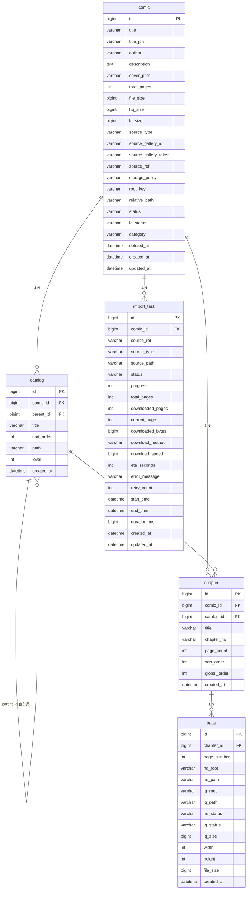

# 数据库 Schema 文档

> 基于 `api-service/src/main/resources/db/schema.sql` 及 Java 实体/枚举生成。
> 最后更新: 2026-07-16

---

## ER 图



---

## 表字段说明

### comic

漫画主表。

| 字段 | 类型 | 默认值 | 说明 |
|------|------|--------|------|
| `id` | BIGINT | AUTO_INCREMENT | 主键 |
| `title` | VARCHAR(255) | NOT NULL | 漫画标题 |
| `title_jpn` | VARCHAR(255) | NULL | 日文标题 |
| `author` | VARCHAR(255) | NULL | 作者 |
| `description` | TEXT | NULL | 简介 |
| `cover_path` | VARCHAR(512) | NULL | 封面路径 |
| `total_pages` | INT | 0 | 总页数 |
| `file_size` | BIGINT | 0 | 原始文件总大小 (字节) |
| `hq_size` | BIGINT | 0 | HQ 图片总大小 (字节) |
| `lq_size` | BIGINT | 0 | LQ 图片总大小 (字节) |
| `source_type` | VARCHAR(16) | NULL | 来源类型，见 [SourceType](#sourcetype) |
| `source_gallery_id` | VARCHAR(64) | NULL | 来源画廊 ID |
| `source_gallery_token` | VARCHAR(32) | NULL | 来源画廊 Token |
| `source_ref` | VARCHAR(512) | NULL | 来源引用 (URL 或路径) |
| `storage_policy` | VARCHAR(16) | `'MANAGED'` | 存储策略 |
| `root_key` | VARCHAR(32) | `'LOCAL'` | 存储根键 |
| `relative_path` | VARCHAR(512) | NULL | 相对路径 |
| `status` | VARCHAR(16) | `'IMPORTING'` | 漫画状态，见 [ComicStatus](#comicstatus) |
| `lq_status` | VARCHAR(16) | NULL | LQ 生成状态，见 [LqStatus](#lqstatus) |
| `category` | VARCHAR(64) | NULL | 分类 |
| `deleted_at` | DATETIME | NULL | 软删除时间 |
| `created_at` | DATETIME | CURRENT_TIMESTAMP | 创建时间 |
| `updated_at` | DATETIME | CURRENT_TIMESTAMP ON UPDATE | 更新时间 |

**索引**:
- `UNIQUE idx_source (source_type, source_gallery_id)`
- `INDEX idx_status (status)`
- `INDEX idx_created_at (created_at)`

---

### catalog

目录表，支持多级树形结构。

| 字段 | 类型 | 默认值 | 说明 |
|------|------|--------|------|
| `id` | BIGINT | AUTO_INCREMENT | 主键 |
| `comic_id` | BIGINT | NOT NULL | 所属漫画，FK → comic(id) |
| `parent_id` | BIGINT | NULL | 父目录，FK → catalog(id)，自引用 |
| `title` | VARCHAR(255) | NOT NULL | 目录标题 |
| `sort_order` | INT | 0 | 同级排序序号 |
| `path` | VARCHAR(512) | NULL | 目录路径 (用于快速查找) |
| `level` | INT | 0 | 层级深度 |
| `created_at` | DATETIME | CURRENT_TIMESTAMP | 创建时间 |

**索引**:
- `UNIQUE uk_comic_parent_title (comic_id, parent_id, title)`
- `INDEX idx_comic_parent (comic_id, parent_id)`
- `INDEX idx_path (path)`

**外键**:
- `comic_id` → `comic(id)` ON DELETE CASCADE
- `parent_id` → `catalog(id)` ON DELETE CASCADE

---

### chapter

章节表。排序仅依赖 `global_order`，`chapter_no` 为原始编号不参与排序。

| 字段 | 类型 | 默认值 | 说明 |
|------|------|--------|------|
| `id` | BIGINT | AUTO_INCREMENT | 主键 |
| `comic_id` | BIGINT | NOT NULL | 所属漫画，FK → comic(id) |
| `catalog_id` | BIGINT | NULL | 所属目录，FK → catalog(id) |
| `title` | VARCHAR(255) | NULL | 章节标题 |
| `chapter_no` | VARCHAR(32) | `'1'` | 原始编号 (不参与排序) |
| `page_count` | INT | 0 | 页数 |
| `sort_order` | INT | 0 | 目录内排序 |
| `global_order` | INT | 0 | 全书阅读顺序 |
| `created_at` | DATETIME | CURRENT_TIMESTAMP | 创建时间 |

**索引**:
- `UNIQUE uk_catalog_chapter (comic_id, catalog_id, chapter_no)`
- `INDEX idx_comic_global (comic_id, global_order)`

**外键**:
- `comic_id` → `comic(id)` ON DELETE CASCADE
- `catalog_id` → `catalog(id)` ON DELETE SET NULL

---

### page

页面表。每页对应一张 HQ 图片，可选 LQ 缩略图。

| 字段 | 类型 | 默认值 | 说明 |
|------|------|--------|------|
| `id` | BIGINT | AUTO_INCREMENT | 主键 |
| `chapter_id` | BIGINT | NOT NULL | 所属章节，FK → chapter(id) |
| `page_number` | INT | NOT NULL | 页码 (章节内从 1 开始) |
| `hq_root` | VARCHAR(32) | `'HQ'` | HQ 存储根键 |
| `hq_path` | VARCHAR(512) | NULL | HQ 相对路径 |
| `lq_root` | VARCHAR(32) | NULL | LQ 存储根键 |
| `lq_path` | VARCHAR(512) | NULL | LQ 相对路径 |
| `hq_status` | VARCHAR(16) | `'PENDING'` | HQ 状态，见 [HqStatus](#hqstatus) |
| `lq_status` | VARCHAR(16) | `'NOT_GENERATED'` | LQ 状态，见 [LqStatus](#lqstatus) |
| `lq_size` | BIGINT | 0 | LQ 文件大小 (字节) |
| `width` | INT | NULL | 图片宽度 (像素) |
| `height` | INT | NULL | 图片高度 (像素) |
| `file_size` | BIGINT | NULL | HQ 文件大小 (字节) |
| `created_at` | DATETIME | CURRENT_TIMESTAMP | 创建时间 |

**索引**:
- `UNIQUE uk_chapter_page (chapter_id, page_number)`

**外键**:
- `chapter_id` → `chapter(id)` ON DELETE CASCADE

> **注意**: Page 实体中文件大小字段为 `fileSize` (对应 DDL `file_size`) 和 `lqSize` (对应 DDL `lq_size`)。Page 不包含 HQ 总大小字段。

---

### import_task

导入任务表。记录每次导入的来源、进度和结果。

| 字段 | 类型 | 默认值 | 说明 |
|------|------|--------|------|
| `id` | BIGINT | AUTO_INCREMENT | 主键 |
| `comic_id` | BIGINT | NULL | 关联漫画，FK → comic(id) |
| `source_ref` | VARCHAR(512) | NULL | 来源引用 |
| `source_type` | VARCHAR(16) | NULL | 来源类型，见 [SourceType](#sourcetype) |
| `source_path` | VARCHAR(1024) | NULL | 来源路径 (ZIP 或目录) |
| `status` | VARCHAR(16) | `'PENDING'` | 任务状态，见 [ImportTaskStatus](#importtaskstatus) |
| `progress` | INT | 0 | 进度百分比 (0-100) |
| `total_pages` | INT | NULL | 总页数 |
| `downloaded_pages` | INT | 0 | 已下载页数 |
| `current_page` | INT | 0 | 当前处理页 |
| `downloaded_bytes` | BIGINT | 0 | 已下载字节数 |
| `download_method` | VARCHAR(32) | `'HTTP'` | 下载方式 |
| `download_speed` | BIGINT | 0 | 下载速度 (字节/秒) |
| `eta_seconds` | INT | 0 | 预计剩余时间 (秒) |
| `error_message` | VARCHAR(1024) | NULL | 错误信息 |
| `retry_count` | INT | 0 | 重试次数 |
| `start_time` | DATETIME | NULL | 开始时间 |
| `end_time` | DATETIME | NULL | 结束时间 |
| `duration_ms` | BIGINT | NULL | 耗时 (毫秒) |
| `created_at` | DATETIME | CURRENT_TIMESTAMP | 创建时间 |
| `updated_at` | DATETIME | CURRENT_TIMESTAMP ON UPDATE | 更新时间 |

**索引**:
- `INDEX idx_status (status)`

**外键**:
- `comic_id` → `comic(id)` ON DELETE SET NULL

---

## 状态/值枚举

以下枚举定义来自 `com.comicatlas.api.common.enums` 包。数据库中均以 `VARCHAR` 存储枚举名称字符串。

### ComicStatus

漫画生命周期状态。

| 值 | 说明 |
|----|------|
| `IMPORTING` | 导入中 |
| `READY` | 就绪 (导入完成) |
| `DELETING` | 删除中 |
| `DELETED` | 已删除 |
| `RESCANNING` | 重新扫描中 |

```java
public enum ComicStatus { IMPORTING, READY, DELETING, DELETED, RESCANNING }
```

---

### HqStatus

HQ (高清) 图片状态。

| 值 | 说明 |
|----|------|
| `PENDING` | 待处理 |
| `READY` | 就绪 |
| `MISSING` | 缺失 |

```java
public enum HqStatus { PENDING, READY, MISSING }
```

---

### LqStatus

LQ (低清/缩略图) 生成状态。不自动生成，需手动触发。

| 值 | 说明 |
|----|------|
| `NOT_GENERATED` | 未生成 (默认) |
| `QUEUED` | 已入队 |
| `GENERATING` | 生成中 |
| `READY` | 就绪 |
| `FAILED` | 失败 |

```java
public enum LqStatus { NOT_GENERATED, QUEUED, GENERATING, READY, FAILED }
```

---

### ImportTaskStatus

导入任务状态。

| 值 | 说明 |
|----|------|
| `PENDING` | 等待处理 (默认) |
| `PARSING` | 解析中 |
| `IMPORTING` | 导入中 |
| `SUCCESS` | 成功 |
| `FAILED` | 失败 |

```java
public enum ImportTaskStatus { PENDING, PARSING, IMPORTING, SUCCESS, FAILED }
```

> **注意**: 代码中存在 `CANCELLED` 和 `DOWNLOADING` 两个字符串值，用于业务逻辑判断 (如取消任务、下载进度回调)，但它们 **未定义在 `ImportTaskStatus` 枚举中**，而是以字符串字面量形式出现在 `ImportServiceImpl` 和 `ImportEventHandler` 中。

---

### SourceType

导入来源类型。

| 值 | 说明 |
|----|------|
| `ZIP` | ZIP 压缩包 |
| `REGISTER` | 本地目录注册 |
| `EHENTAI` | E-Hentai 画廊 |

```java
public enum SourceType { ZIP, REGISTER, EHENTAI }
```
