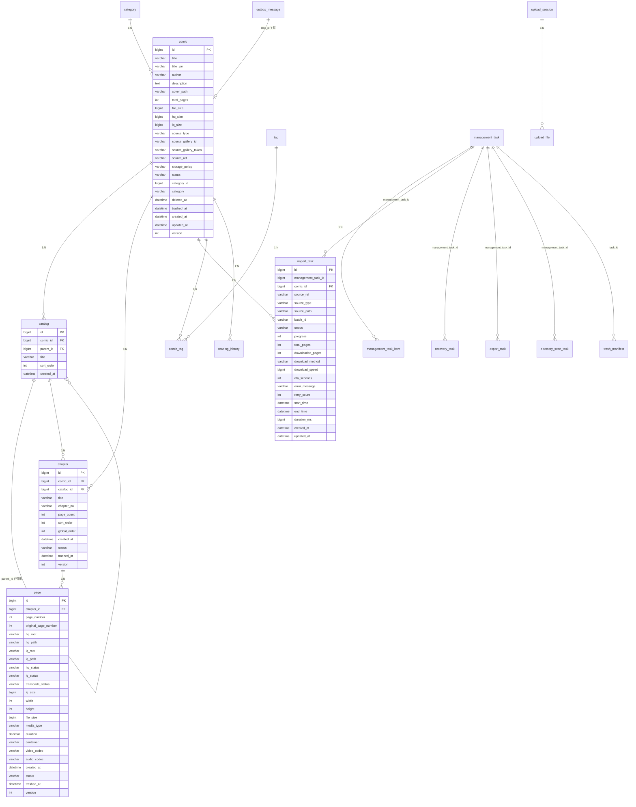

# 数据库 Schema 文档

> 基于 `api-service/src/main/resources/db/schema.sql`（空库执行 Flyway V1..V20 后的最终结构）及 Java 实体/枚举生成。
> 最后更新: 2026-08-12

---

## ER 图


```mermaid
erDiagram
    comic ||--o{ catalog : "1:N"
    comic ||--o{ chapter : "1:N"
    comic ||--o{ import_task : "1:N"
    category ||--o{ comic : "1:N"
    comic ||--o{ comic_tag : "1:N"
    tag ||--o{ comic_tag : "1:N"
    comic ||--o{ reading_history : "1:N"
    catalog ||--o{ catalog : "parent_id 自引用"
    catalog ||--o{ chapter : "1:N"
    chapter ||--o{ page : "1:N"
    management_task ||--o{ management_task_item : "1:N"
    management_task ||--o{ import_task : "management_task_id"
    management_task ||--o{ recovery_task : "management_task_id"
    management_task ||--o{ export_task : "management_task_id"
    management_task ||--o{ directory_scan_task : "management_task_id"
    management_task ||--o{ trash_manifest : "task_id"
    upload_session ||--o{ upload_file : "1:N"
    outbox_message ||--o| comic : "task_id 关联"

    comic {
        bigint id PK
        varchar title
        varchar title_jpn
        varchar author
        text description
        varchar cover_path
        int total_pages
        bigint file_size
        bigint hq_size
        bigint lq_size
        varchar source_type
        varchar source_gallery_id
        varchar source_gallery_token
        varchar source_ref
        varchar storage_policy
        varchar status
        bigint category_id
        varchar category
        datetime deleted_at
        datetime trashed_at
        datetime created_at
        datetime updated_at
        int version
    }

    catalog {
        bigint id PK
        bigint comic_id FK
        bigint parent_id FK
        varchar title
        int sort_order
        datetime created_at
    }

    chapter {
        bigint id PK
        bigint comic_id FK
        bigint catalog_id FK
        varchar title
        varchar chapter_no
        int page_count
        int sort_order
        int global_order
        datetime created_at
        varchar status
        datetime trashed_at
        int version
    }

    page {
        bigint id PK
        bigint chapter_id FK
        int page_number
        int original_page_number
        varchar hq_root
        varchar hq_path
        varchar lq_root
        varchar lq_path
        varchar hq_status
        varchar lq_status
        varchar transcode_status
        bigint lq_size
        int width
        int height
        bigint file_size
        varchar media_type
        decimal duration
        varchar container
        varchar video_codec
        varchar audio_codec
        datetime created_at
        varchar status
        datetime trashed_at
        int version
    }

    import_task {
        bigint id PK
        bigint management_task_id
        bigint comic_id FK
        varchar source_ref
        varchar source_type
        varchar source_path
        varchar batch_id
        varchar status
        int progress
        int total_pages
        int downloaded_pages
        varchar download_method
        bigint download_speed
        int eta_seconds
        varchar error_message
        int retry_count
        datetime start_time
        datetime end_time
        bigint duration_ms
        datetime created_at
        datetime updated_at
    }
```

---

## 表字段说明

### comic

漫画主表。

| 字段 | 类型 | 默认值 | 说明 |
|------|------|--------|------|
| `id` | BIGINT | AUTO_INCREMENT | 主键 |
| `title` | VARCHAR(255) | NOT NULL | 漫画标题 |
| `title_jpn` | VARCHAR(255) | NULL | 日文标题 |
| `author` | VARCHAR(255) | NULL | 作者 |
| `description` | TEXT | NULL | 简介 |
| `cover_path` | VARCHAR(512) | NULL | 封面路径（DEPRECATED，封面统一用 thumbs/{comicId}/cover.webp） |
| `total_pages` | INT | `0` | 总页数 |
| `file_size` | BIGINT | `0` | 原始文件总大小 (字节) |
| `hq_size` | BIGINT | `0` | HQ 图片总大小 (字节) |
| `lq_size` | BIGINT | `0` | LQ 图片总大小 (字节) |
| `source_type` | VARCHAR(16) | NULL | 来源类型，见 [SourceType](#sourcetype) |
| `source_gallery_id` | VARCHAR(64) | NULL | 来源画廊 ID |
| `source_gallery_token` | VARCHAR(32) | NULL | 来源画廊 Token |
| `source_ref` | VARCHAR(512) | NULL | 来源引用 (URL 或路径) |
| `storage_policy` | VARCHAR(16) | `MANAGED` | 存储策略 |
| `status` | VARCHAR(32) | `IMPORTING` | 漫画状态，见 [ComicStatus](#comicstatus) |
| `category_id` | BIGINT | NULL | 分类，FK → category(id) |
| `category` | VARCHAR(64) | NULL | 分类名称（旧字段保留） |
| `deleted_at` | DATETIME | NULL | 软删除时间 |
| `trashed_at` | DATETIME | NULL | 进入 TRASHED 的时间（7 天保留期起点） |
| `created_at` | DATETIME | `CURRENT_TIMESTAMP` | 创建时间 |
| `updated_at` | DATETIME | `CURRENT_TIMESTAMP` ON UPDATE | 更新时间 |
| `version` | INT | `1` | 乐观锁版本号 |

**索引**:
- `UNIQUE idx_source (source_type, source_gallery_id)`
- `INDEX idx_status (status)`
- `INDEX idx_category_id (category_id)`
- `INDEX idx_created_at (created_at)`

---

### catalog

目录表，支持多级树形结构。

| 字段 | 类型 | 默认值 | 说明 |
|------|------|--------|------|
| `id` | BIGINT | AUTO_INCREMENT | 主键 |
| `comic_id` | BIGINT | NOT NULL | 所属漫画，FK → comic(id) |
| `parent_id` | BIGINT | NULL | 父目录，FK → catalog(id)，自引用 |
| `title` | VARCHAR(255) | NOT NULL | 目录标题 |
| `sort_order` | INT | `0` | 同级排序序号 |
| `created_at` | DATETIME | `CURRENT_TIMESTAMP` | 创建时间 |

**索引**:
- `UNIQUE uk_comic_parent_title (comic_id, parent_id, title)`
- `INDEX idx_comic_parent (comic_id, parent_id)`

**外键**:
- `catalog_ibfk_1`: comic_id → comic(id) ON DELETE CASCADE
- `catalog_ibfk_2`: parent_id → catalog(id) ON DELETE CASCADE

---

### chapter

章节表。排序仅依赖 `global_order`，`chapter_no` 为原始编号不参与排序。

| 字段 | 类型 | 默认值 | 说明 |
|------|------|--------|------|
| `id` | BIGINT | AUTO_INCREMENT | 主键 |
| `comic_id` | BIGINT | NOT NULL | 所属漫画，FK → comic(id) |
| `catalog_id` | BIGINT | NULL | 所属目录，FK → catalog(id) |
| `title` | VARCHAR(255) | NULL | 章节标题 |
| `chapter_no` | VARCHAR(32) | `1` | 原始编号 (不参与排序) |
| `page_count` | INT | `0` | 页数 |
| `sort_order` | INT | `0` | 目录内排序 |
| `global_order` | INT | `0` | 全书阅读顺序 |
| `created_at` | DATETIME | `CURRENT_TIMESTAMP` | 创建时间 |
| `status` | VARCHAR(16) | `READY` | 章节生命周期状态，见 [MediaLifecycleStatus](#medialifecyclestatus) |
| `trashed_at` | DATETIME | NULL | 进入 TRASHED 的时间（7 天保留期起点） |
| `version` | INT | `1` | 乐观锁版本号 |

**索引**:
- `UNIQUE uk_chapter_comic_id (comic_id, id)`
- `UNIQUE uk_catalog_chapter (comic_id, catalog_id, chapter_no)`
- `UNIQUE uk_comic_global (comic_id, global_order)`
- `INDEX idx_comic_global (comic_id, global_order)`

**外键**:
- `chapter_ibfk_1`: comic_id → comic(id) ON DELETE CASCADE
- `chapter_ibfk_2`: catalog_id → catalog(id) ON DELETE SET NULL

---

### page

页面表。每页对应一张 HQ 图片，可选 LQ 缩略图；支持图片与视频混排。

| 字段 | 类型 | 默认值 | 说明 |
|------|------|--------|------|
| `id` | BIGINT | AUTO_INCREMENT | 主键 |
| `chapter_id` | BIGINT | NOT NULL | 所属章节，FK → chapter(id) |
| `page_number` | INT | NOT NULL | 页码 (章节内从 1 开始) |
| `original_page_number` | INT | NULL | 回收前原页码，恢复时优先复用 |
| `hq_root` | VARCHAR(32) | `HQ` | HQ 存储根键 |
| `hq_path` | VARCHAR(512) | NULL | HQ 相对路径 |
| `lq_root` | VARCHAR(32) | NULL | LQ 存储根键 |
| `lq_path` | VARCHAR(512) | NULL | LQ 相对路径 |
| `hq_status` | VARCHAR(32) | `PENDING` | HQ 状态，见 [HqStatus](#hqstatus) |
| `lq_status` | VARCHAR(32) | `NOT_GENERATED` | LQ 状态，见 [LqStatus](#lqstatus) |
| `transcode_status` | VARCHAR(32) | `NOT_NEEDED` | 视频转码状态，见 [TranscodeStatus](#transcodestatus) |
| `lq_size` | BIGINT | `0` | LQ 文件大小 (字节) |
| `width` | INT | NULL | 图片宽度 (像素) |
| `height` | INT | NULL | 图片高度 (像素) |
| `file_size` | BIGINT | NULL | HQ 文件大小 (字节) |
| `media_type` | VARCHAR(32) | `IMAGE` | 媒体类型: IMAGE / VIDEO |
| `duration` | DECIMAL(10,3) | NULL | 视频时长 (秒) |
| `container` | VARCHAR(32) | NULL | 视频容器格式 (mp4/webm/mkv 等) |
| `video_codec` | VARCHAR(32) | NULL | 视频编码 |
| `audio_codec` | VARCHAR(32) | NULL | 音频编码 |
| `created_at` | DATETIME | `CURRENT_TIMESTAMP` | 创建时间 |
| `status` | VARCHAR(16) | `READY` | 媒体生命周期状态，见 [MediaLifecycleStatus](#medialifecyclestatus) |
| `trashed_at` | DATETIME | NULL | 进入 TRASHED 的时间（7 天保留期起点） |
| `version` | INT | `1` | 乐观锁版本号 |

**索引**:
- `UNIQUE uk_chapter_page (chapter_id, page_number)`
- `INDEX idx_media_type (media_type)`

**外键**:
- `page_ibfk_1`: chapter_id → chapter(id) ON DELETE CASCADE

> **注意**: 视频元数据由 Worker 端 `MediaAnalyzer` 通过 `ffprobe` 提取，不可用时优雅降级。

---

### tag

标签表。

| 字段 | 类型 | 默认值 | 说明 |
|------|------|--------|------|
| `id` | BIGINT | AUTO_INCREMENT | 主键 |
| `name` | VARCHAR(255) | NOT NULL | 标签名称 |
| `type` | VARCHAR(32) | NULL | 标签类型 |

**索引**:
- `UNIQUE idx_name_type (name, type)`

---

### comic_tag

漫画-标签多对多关联表。

| 字段 | 类型 | 默认值 | 说明 |
|------|------|--------|------|
| `comic_id` | BIGINT | NOT NULL | 漫画 ID |
| `tag_id` | BIGINT | NOT NULL | 标签 ID |

**索引**:
- `PRIMARY (comic_id, tag_id)`

**外键**:
- `comic_tag_ibfk_1`: comic_id → comic(id) ON DELETE CASCADE
- `comic_tag_ibfk_2`: tag_id → tag(id) ON DELETE CASCADE

---

### category

漫画分类表。

| 字段 | 类型 | 默认值 | 说明 |
|------|------|--------|------|
| `id` | BIGINT | AUTO_INCREMENT | 主键 |
| `name` | VARCHAR(64) | NOT NULL | 分类名称（唯一） |
| `sort_order` | INT | `0` | 排序序号 |
| `created_at` | DATETIME | `CURRENT_TIMESTAMP` | 创建时间 |
| `updated_at` | DATETIME | `CURRENT_TIMESTAMP` ON UPDATE | 更新时间 |

**索引**:
- `UNIQUE name (name)`

---

### import_task

导入任务表。记录每次导入的来源、进度和结果。

| 字段 | 类型 | 默认值 | 说明 |
|------|------|--------|------|
| `id` | BIGINT | AUTO_INCREMENT | 主键 |
| `management_task_id` | BIGINT | NULL | 关联 management_task.id 一对一扩展 |
| `comic_id` | BIGINT | NULL | 关联漫画，FK → comic(id) |
| `source_ref` | VARCHAR(512) | NULL | 来源引用 |
| `source_type` | VARCHAR(16) | NULL | 来源类型，见 [SourceType](#sourcetype) |
| `source_path` | VARCHAR(1024) | NULL | 来源路径 (ZIP 或目录) |
| `batch_id` | VARCHAR(64) | NULL | 批量任务批次 ID |
| `status` | VARCHAR(32) | `PENDING` | 任务状态，见 [ImportTaskStatus](#importtaskstatus) |
| `progress` | INT | `0` | 进度百分比 (0-100) |
| `total_pages` | INT | NULL | 总页数 |
| `downloaded_pages` | INT | `0` | 已下载页数 |
| `download_method` | VARCHAR(32) | `HTTP` | 下载方式 |
| `download_speed` | BIGINT | `0` | 下载速度 (字节/秒) |
| `eta_seconds` | INT | `0` | 预计剩余时间 (秒) |
| `error_message` | VARCHAR(1024) | NULL | 错误信息 |
| `retry_count` | INT | `0` | 重试次数 |
| `start_time` | DATETIME | NULL | 开始时间 |
| `end_time` | DATETIME | NULL | 结束时间 |
| `duration_ms` | BIGINT | NULL | 耗时 (毫秒) |
| `created_at` | DATETIME | `CURRENT_TIMESTAMP` | 创建时间 |
| `updated_at` | DATETIME | `CURRENT_TIMESTAMP` ON UPDATE | 更新时间 |

**索引**:
- `INDEX idx_status (status)`
- `INDEX idx_batch_id (batch_id)`

**外键**:
- `import_task_ibfk_1`: comic_id → comic(id) ON DELETE SET NULL

---

### recovery_task

存储恢复任务表。从 HQ 文件恢复漫画数据库记录。

| 字段 | 类型 | 默认值 | 说明 |
|------|------|--------|------|
| `id` | BIGINT | AUTO_INCREMENT | 主键 |
| `management_task_id` | BIGINT | NULL | 关联 management_task.id 一对一扩展 |
| `status` | VARCHAR(32) | `QUEUED` | 任务状态 |
| `total_comics` | INT | `0` | 总漫画数 |
| `recovered_comics` | INT | `0` | 已恢复漫画数 |
| `skipped_comics` | INT | `0` | 跳过漫画数 |
| `placeholder_comics` | INT | `0` | 占位漫画数 |
| `error_comics` | INT | `0` | 错误漫画数 |
| `error_message` | TEXT | NULL | 错误摘要 |
| `error_details` | TEXT | NULL | 错误详情 |
| `retry_count` | INT | `0` | 重试次数 |
| `created_at` | DATETIME | `CURRENT_TIMESTAMP` | 创建时间 |
| `started_at` | DATETIME | NULL | 开始时间 |
| `ended_at` | DATETIME | NULL | 结束时间 |

**索引**:
- `INDEX idx_status (status)`
- `INDEX idx_created_at (created_at)`

---

### directory_scan_task

漫画集根目录批量发现任务表。

| 字段 | 类型 | 默认值 | 说明 |
|------|------|--------|------|
| `id` | BIGINT | AUTO_INCREMENT | 主键 |
| `management_task_id` | BIGINT | NULL | 关联 management_task.id 一对一扩展 |
| `status` | VARCHAR(32) | `PENDING` | 任务状态 |
| `directory_path` | VARCHAR(1024) | NOT NULL | 扫描的根目录路径 |
| `total_items` | INT | `0` | 发现项总数 |
| `result_json` | MEDIUMTEXT | NULL | 扫描结果 JSON |
| `error_message` | TEXT | NULL | 错误信息 |
| `created_at` | DATETIME | `CURRENT_TIMESTAMP` | 创建时间 |
| `started_at` | DATETIME | NULL | 开始时间 |
| `ended_at` | DATETIME | NULL | 结束时间 |

**索引**:
- `INDEX idx_status (status)`
- `INDEX idx_created_at (created_at)`

---

### export_task

导出任务表。记录分卷 ZIP 导出任务。

| 字段 | 类型 | 默认值 | 说明 |
|------|------|--------|------|
| `id` | BIGINT | AUTO_INCREMENT | 主键 |
| `management_task_id` | BIGINT | NULL | 关联 management_task.id 一对一扩展 |
| `comic_id` | BIGINT | NOT NULL | 导出漫画 |
| `status` | VARCHAR(20) | `PENDING` | 任务状态 |
| `progress` | SMALLINT | `0` | 进度 0-100 |
| `output_root` | VARCHAR(20) | NULL | 输出存储根键 |
| `output_path` | VARCHAR(500) | NULL | 输出相对路径 |
| `output_size` | BIGINT | `0` | 产物总大小 (字节) |
| `error_msg` | VARCHAR(500) | NULL | 错误信息 |
| `created_at` | DATETIME | `CURRENT_TIMESTAMP` | 创建时间 |
| `completed_at` | DATETIME | NULL | 完成时间 |

**索引**:
- `INDEX idx_comic_id (comic_id)`
- `INDEX idx_status (status)`
- `INDEX idx_created_at (created_at)`

---

### reading_history

阅读历史表。每本漫画最多保留一条记录（唯一 comic_id）。

| 字段 | 类型 | 默认值 | 说明 |
|------|------|--------|------|
| `id` | BIGINT | AUTO_INCREMENT | 主键 |
| `comic_id` | BIGINT | NOT NULL | 漫画 ID |
| `chapter_id` | BIGINT | NOT NULL | 章节 ID |
| `page_number` | INT | `1` | 页码 |
| `created_at` | DATETIME | `CURRENT_TIMESTAMP` | 创建时间 |
| `updated_at` | DATETIME | `CURRENT_TIMESTAMP` ON UPDATE | 更新时间 |

**索引**:
- `UNIQUE uk_comic (comic_id)`
- `INDEX idx_history_comic_chapter (comic_id, chapter_id)`

**外键**:
- `reading_history_ibfk_1`: comic_id → comic(id) ON DELETE CASCADE
- `reading_history_ibfk_2`: chapter_id → chapter(id) ON DELETE CASCADE
- `fk_history_chapter_comic`: (comic_id, chapter_id) → chapter(comic_id, id) ON DELETE CASCADE

---

### outbox_message

事务 Outbox 消息表（可靠消息发送）。

| 字段 | 类型 | 默认值 | 说明 |
|------|------|--------|------|
| `event_id` | VARCHAR(36) | NOT NULL | 事件 UUID（PK） |
| `task_id` | BIGINT | NULL | 关联 management_task.id（可选） |
| `item_id` | BIGINT | NULL | 关联 management_task_item.id（可选） |
| `attempt` | INT | `0` | task/item attempt 快照 |
| `exchange` | VARCHAR(128) | NOT NULL | 目标 exchange |
| `routing_key` | VARCHAR(128) | NOT NULL | 目标 routing key |
| `event_type` | VARCHAR(128) | NOT NULL | ComicEvent.eventType |
| `version` | INT | `1` | ComicEvent.version() |
| `payload` | MEDIUMTEXT | NOT NULL | JSON 序列化的事件体 |
| `publish_attempts` | INT | `0` | relay 发布尝试次数 |
| `status` | VARCHAR(16) | `PENDING` | PENDING/PUBLISHED/FAILED |
| `available_at` | DATETIME | `CURRENT_TIMESTAMP` | 最早可发布时间 |
| `published_at` | DATETIME | NULL | 确认发布时间 |
| `last_error` | VARCHAR(2048) | NULL | 最后一次发布错误 |
| `created_at` | DATETIME | `CURRENT_TIMESTAMP` | 创建时间 |

**索引**:
- `PRIMARY (event_id)`
- `INDEX idx_om_status_available (status, available_at)`
- `INDEX idx_om_task_id (task_id)`
- `INDEX idx_om_published_at (published_at)`
- `INDEX idx_om_created_at (created_at)`

---

### inbox_receipt

结果 Inbox 收据表（幂等消费去重）。

| 字段 | 类型 | 默认值 | 说明 |
|------|------|--------|------|
| `event_id` | VARCHAR(36) | NOT NULL | 事件 UUID（PK） |
| `payload_hash` | VARCHAR(64) | NOT NULL | payload SHA-256 |
| `task_id` | BIGINT | NULL | 关联 management_task.id（可选） |
| `item_id` | BIGINT | NULL | 关联 management_task_item.id（可选） |
| `attempt` | INT | `0` | task/item attempt 快照 |
| `processed_at` | DATETIME | `CURRENT_TIMESTAMP` | 处理时间 |
| `created_at` | DATETIME | `CURRENT_TIMESTAMP` | 创建时间 |

**索引**:
- `PRIMARY (event_id)`
- `INDEX idx_ir_processed_at (processed_at)`
- `INDEX idx_ir_task_id (task_id)`

---

### management_task

统一管理任务主表（导入/恢复/导出/目录扫描等任务的统一入口）。

| 字段 | 类型 | 默认值 | 说明 |
|------|------|--------|------|
| `id` | BIGINT | AUTO_INCREMENT | 主键 |
| `task_type` | VARCHAR(32) | NOT NULL | 任务类型: IMPORT/RECOVERY/EXPORT/DIRECTORY_SCAN |
| `operation` | VARCHAR(64) | NOT NULL | 操作描述 |
| `target_type` | VARCHAR(32) | NULL | 目标类型: COMIC/DIRECTORY/SYSTEM |
| `batch_id` | VARCHAR(36) | NULL | 批次ID，关联 import_task.batch_id 等 |
| `is_batch` | TINYINT(1) | `0` | 是否批量任务 |
| `status` | VARCHAR(32) | `QUEUED` | 任务状态: QUEUED/RUNNING/CANCELLING/CANCELLED/SUCCEEDED/PARTIALLY_SUCCEEDED/FAILED |
| `stage` | VARCHAR(64) | NULL | 当前阶段描述 |
| `progress` | INT | `0` | 聚合进度 0-100 |
| `total_count` | INT | `0` | 总目标数 |
| `success_count` | INT | `0` | 成功项数 |
| `failure_count` | INT | `0` | 失败项数 |
| `cancelled_count` | INT | `0` | 取消项数 |
| `idempotency_key` | VARCHAR(128) | NULL | 幂等键，同键同payload返回原任务（唯一） |
| `idempotency_payload_hash` | VARCHAR(64) | NULL | 幂等负载 SHA-256 |
| `error_message` | VARCHAR(4096) | NULL | 错误摘要 |
| `error_detail` | TEXT | NULL | 错误详情 JSON |
| `attempt` | INT | `1` | 当前第几次尝试 |
| `version` | INT | `0` | @Version 乐观锁 |
| `created_at` | DATETIME | `CURRENT_TIMESTAMP` | 创建时间 |
| `updated_at` | DATETIME | `CURRENT_TIMESTAMP` ON UPDATE | 更新时间 |
| `started_at` | DATETIME | NULL | 开始时间 |
| `completed_at` | DATETIME | NULL | 完成时间 |

**索引**:
- `UNIQUE uk_mt_idempotency_key (idempotency_key)`
- `INDEX idx_mt_task_type (task_type)`
- `INDEX idx_mt_status (status)`
- `INDEX idx_mt_batch_id (batch_id)`
- `INDEX idx_mt_created_at (created_at)`

---

### management_task_item

统一管理任务目标项表（批量任务逐项进度与结果）。

| 字段 | 类型 | 默认值 | 说明 |
|------|------|--------|------|
| `id` | BIGINT | AUTO_INCREMENT | 主键 |
| `task_id` | BIGINT | NOT NULL | 关联 management_task.id |
| `target_type` | VARCHAR(32) | NOT NULL | 目标类型: COMIC/DIRECTORY |
| `target_id` | BIGINT | NOT NULL | 目标ID |
| `operation_type` | VARCHAR(32) | NOT NULL | 操作类型: IMPORT/RECOVERY/EXPORT/DIRECTORY_SCAN |
| `status` | VARCHAR(32) | `QUEUED` | 项状态 |
| `attempt` | INT | `1` | 第几次尝试 |
| `progress` | INT | `0` | 进度 0-100 |
| `result_ref_type` | VARCHAR(32) | NULL | 结果引用表类型: IMPORT_TASK/EXPORT_TASK 等 |
| `result_ref_id` | BIGINT | NULL | 结果引用表 ID |
| `error_message` | VARCHAR(4096) | NULL | 错误信息 |
| `lock_key` | VARCHAR(128) | NULL | 活跃锁键 targetType:targetId:operationType，完成时设NULL释放唯一约束 |
| `version` | INT | `0` | @Version 乐观锁 |
| `created_at` | DATETIME | `CURRENT_TIMESTAMP` | 创建时间 |
| `updated_at` | DATETIME | `CURRENT_TIMESTAMP` ON UPDATE | 更新时间 |
| `started_at` | DATETIME | NULL | 开始时间 |
| `completed_at` | DATETIME | NULL | 完成时间 |

**索引**:
- `UNIQUE uk_mti_active_target_lock (lock_key)`
- `INDEX idx_mti_task_id (task_id)`
- `INDEX idx_mti_target (target_type, target_id)`
- `INDEX idx_mti_status (status)`

**外键**:
- `fk_mti_task`: task_id → management_task(id) ON DELETE CASCADE

---

### upload_session

分片上传会话表。

| 字段 | 类型 | 默认值 | 说明 |
|------|------|--------|------|
| `id` | BIGINT | AUTO_INCREMENT | 主键 |
| `session_id` | VARCHAR(64) | NOT NULL | 对外 opaque 会话 ID（UUID） |
| `comic_id` | BIGINT | NOT NULL | 目标漫画 |
| `chapter_id` | BIGINT | NOT NULL | 目标章节 |
| `replace_media_id` | BIGINT | NULL | 替换目标媒体 ID（replace 流程） |
| `status` | VARCHAR(16) | `ACTIVE` | ACTIVE/COMPLETED/CANCELLED/EXPIRED/FAILED |
| `total_bytes` | BIGINT | `0` | 会话总字节数 |
| `total_files` | INT | `0` | 文件数 |
| `expires_at` | DATETIME | NOT NULL | 未完成过期时间 |
| `completed_at` | DATETIME | NULL | complete 时间 |
| `created_at` | DATETIME | `CURRENT_TIMESTAMP` | 创建时间 |

**索引**:
- `UNIQUE uk_upload_session_id (session_id)`
- `INDEX idx_us_comic (comic_id)`
- `INDEX idx_us_status_expires (status, expires_at)`

---

### upload_file

上传会话内文件表。

| 字段 | 类型 | 默认值 | 说明 |
|------|------|--------|------|
| `id` | BIGINT | AUTO_INCREMENT | 主键 |
| `session_id` | BIGINT | NOT NULL | 关联 upload_session.id |
| `file_id` | VARCHAR(64) | NOT NULL | 客户端 opaque 文件标识 |
| `original_name` | VARCHAR(255) | NOT NULL | 客户端文件名（仅展示，不用于拼路径） |
| `content_type` | VARCHAR(128) | NOT NULL | 客户端声明 Content-Type |
| `size_bytes` | BIGINT | NOT NULL | 声明文件大小 |
| `sha256` | VARCHAR(64) | NOT NULL | 声明文件总 SHA-256 |
| `storage_name` | VARCHAR(255) | NOT NULL | 服务端生成文件名 uuid.ext |
| `received_bytes` | BIGINT | `0` | 已接收最大末端字节 |
| `received_ranges` | TEXT | NULL | 已接收区间串 0-65535;131072-196607 |
| `media_id` | BIGINT | NULL | complete 预建 STAGING media row id |
| `created_at` | DATETIME | `CURRENT_TIMESTAMP` | 创建时间 |
| `updated_at` | DATETIME | `CURRENT_TIMESTAMP` ON UPDATE | 更新时间 |

**索引**:
- `UNIQUE uk_upload_file (session_id, file_id)`
- `INDEX idx_uf_media (media_id)`

**外键**:
- `fk_upload_file_session`: session_id → upload_session(id) ON DELETE CASCADE

---

### trash_manifest

TRASH 资产清单（API 写 DB，Worker 只读 DB + 操作文件）。V20 新增。

| 字段 | 类型 | 默认值 | 说明 |
|------|------|--------|------|
| `task_id` | BIGINT | NOT NULL | 管理任务 ID（唯一，PK） |
| `target_type` | VARCHAR(32) | NOT NULL | 目标类型：COMIC/CHAPTER/MEDIA |
| `target_id` | BIGINT | NOT NULL | 目标实体 ID |
| `manifest_json` | TEXT | NOT NULL | 不可变 TRASH 清单 JSON（TrashManifestDTO） |
| `created_at` | DATETIME | `CURRENT_TIMESTAMP` | 创建时间 |
| `updated_at` | DATETIME | `CURRENT_TIMESTAMP` ON UPDATE | 更新时间 |

**索引**:
- `PRIMARY (task_id)`
- `INDEX idx_target (target_type, target_id)`

---

## 状态/值枚举

以下枚举定义来自 `com.comicatlas.contract.common.enums` 包。数据库中均以 `VARCHAR` 存储枚举名称字符串。

### ComicStatus

漫画生命周期状态。

| 值 | 说明 |
|----|------|
| `IMPORTING` | 导入中 |
| `READY` | 就绪 (导入完成) |
| `REFRESHING` | 元数据刷新中 |
| `DELETING` | 删除中 |
| `DELETED` | 已删除 |
| `RESCANNING` | 重新扫描中 |

```java
public enum ComicStatus { IMPORTING, READY, REFRESHING, DELETING, DELETED, RESCANNING }
```

---

### MediaLifecycleStatus

漫画/章节/页面的统一生命周期状态。

| 值 | 说明 |
|----|------|
| `STAGING` | 暂存中 |
| `READY` | 就绪 |
| `TRASHED` | 已回收 |
| `DELETED` | 已删除 |
| `DELETING` | 删除中 |
| `TRASHING` | 回收中 |
| `RESTORING` | 恢复中 |
| `PURGING` | 永久清理中 |

```java
public enum MediaLifecycleStatus { STAGING, READY, TRASHED, DELETED, DELETING, TRASHING, RESTORING, PURGING }
```

---

### HqStatus

HQ (高清) 图片状态。

| 值 | 说明 |
|----|------|
| `PENDING` | 待处理 (文件复制前) |
| `READY` | 就绪 (文件已就位) |
| `MISSING` | 丢失 (文件缺失) |
| `DELETED` | 已删除 (HQ 已被清理) |

```java
public enum HqStatus { PENDING, READY, MISSING, DELETED }
```

---

### LqStatus

LQ (低清/缩略图) 生成状态。不自动生成，需手动触发。

| 值 | 说明 |
|----|------|
| `NOT_GENERATED` | 未生成 (默认) |
| `QUEUED` | 已入队 |
| `GENERATING` | 生成中 |
| `READY` | 就绪 |
| `FAILED` | 失败 |

```java
public enum LqStatus { NOT_GENERATED, QUEUED, GENERATING, READY, FAILED }
```

---

### TranscodeStatus

视频转码状态。

| 值 | 说明 |
|----|------|
| `NOT_NEEDED` | 无需转码 (默认) |
| `QUEUED` | 已入队 |
| `TRANSCODING` | 转码中 |
| `READY` | 转码完成 |
| `FAILED` | 转码失败 |

```java
public enum TranscodeStatus { NOT_NEEDED, QUEUED, TRANSCODING, READY, FAILED }
```

---

### ImportTaskStatus

导入任务状态。

| 值 | 说明 |
|----|------|
| `PENDING` | 等待处理 (默认) |
| `PARSING` | 解析中 |
| `IMPORTING` | 导入中 |
| `SUCCESS` | 成功 |
| `FAILED` | 失败 |

```java
public enum ImportTaskStatus { PENDING, PARSING, IMPORTING, SUCCESS, FAILED }
```

> **注意**: 代码中存在 `CANCELLED` 和 `DOWNLOADING` 两个字符串值，用于业务逻辑判断 (如取消任务、下载进度回调)，但它们 **未定义在 `ImportTaskStatus` 枚举中**，而是以字符串字面量形式出现在 `ImportServiceImpl` 和 `ImportEventHandler` 中。

---

### SourceType

导入来源类型。

| 值 | 说明 |
|----|------|
| `ZIP` | ZIP 压缩包 |
| `REGISTER` | 本地目录注册 |
| `EHENTAI` | E-Hentai 画廊 |

```java
public enum SourceType { ZIP, REGISTER, EHENTAI }
```
